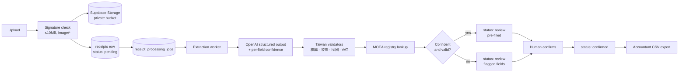

# ReceiptBridge

**Turn a photo of a Taiwan receipt into accountant-ready bookkeeping data.**

Small businesses in Taiwan still hand their accountant a shoebox of 統一發票 at the end of every period. ReceiptBridge closes that gap: snap or upload a receipt, an LLM extracts the structured fields, Taiwan-specific rules validate them (統編 checksum, 發票號碼 format, 民國 dates, 5% VAT arithmetic), a human confirms anything the model was unsure about, and the batch exports as a UTF-8 CSV that opens cleanly in Taiwanese Excel.

[](https://github.com/dantes-hub/receipt/actions/workflows/ci.yml)

---

## Why it exists

Generic OCR gets you text. Bookkeeping needs *trustworthy fields*. The hard part of this problem is not reading the receipt — it's knowing when the read is wrong:

- A 統編 that fails its checksum is not a valid business number, no matter how confidently the model read it.
- `114/04/19` is April 19 **2025**, not year 114.
- If `subtotal + tax ≠ total`, one of the three numbers is misread.
- A 統編 can be looked up against the MOEA public company registry to confirm the vendor actually exists and is still active.

ReceiptBridge runs every extraction through those checks and routes anything doubtful to a human review screen instead of silently exporting bad books.

## Features

- **Upload from phone or desktop** — JPEG / PNG / HEIC / HEIF, up to 10 MB, validated by magic-byte signature rather than the client-supplied MIME type.
- **Structured LLM extraction** — OpenAI structured outputs against a strict Zod schema, with per-field confidence scores and an automatic retry when confidence falls below threshold.
- **Taiwan validation engine** — 統編 checksum (including the special rule for a `7` in position 7), 發票號碼 format, ROC↔Western date conversion, 期別 (bi-monthly invoice period), 5% VAT arithmetic, and a live MOEA company lookup.
- **Human-in-the-loop review** — every field carries a pass / warn / fail badge and a confidence dot; inline edits are persisted as correction logs, which double as training signal for prompt iteration.
- **Accountant CSV export** — Chinese column headers, category → 借方科目 mapping, and a UTF-8 BOM so Excel in Taiwan doesn't mangle the encoding.
- **Durable job queue** — uploads enqueue a row in Postgres and return immediately; extraction runs out-of-band and is retryable, so a cold serverless function or a model timeout never loses a receipt.
- **Bilingual UI** — zh-TW and English throughout, mobile-first (no horizontal overflow at 375px).

## How it works



A receipt moves through `pending → extracting → review → confirmed`, with `error` as the terminal failure state. Nothing reaches the export without a human pressing confirm.

## Stack

| Layer | Choice |
| --- | --- |
| Framework | Next.js 16 (App Router), React 19 |
| Language | TypeScript (strict) |
| Auth | Supabase magic-link auth, route guard in `proxy.ts` |
| Database | Postgres + Drizzle ORM, hand-authored SQL migrations |
| Storage | Supabase private bucket, `{userId}/{year}/{month}/{uuid}.{ext}` |
| AI | OpenAI structured outputs (default `gpt-4o-2024-11-20`) |
| UI | Tailwind CSS v4, shadcn/ui, Radix primitives |
| i18n | `next-intl`, zh-TW + en |
| Testing | Vitest, ESLint, GitHub Actions CI |
| Observability | Structured JSON logs, optional Sentry |

## Getting started

**Prerequisites:** Node 22+, a Supabase project, a Postgres database, and an OpenAI API key.

```bash
git clone https://github.com/dantes-hub/receipt.git
cd receipt
npm install
cp .env.example .env.local   # then fill in the values below
npm run db:migrate
npm run dev
```

The app runs at http://localhost:3000.

### Environment variables

| Variable | Required | Notes |
| --- | --- | --- |
| `NEXT_PUBLIC_SUPABASE_URL` | ✅ | Supabase project URL |
| `NEXT_PUBLIC_SUPABASE_ANON_KEY` | ✅ | Public anon key |
| `SUPABASE_SERVICE_ROLE_KEY` | ✅ | Server-only. Never expose to the client. |
| `DATABASE_URL` | ✅ | Pooled Postgres connection used at runtime |
| `DIRECT_URL` | ✅ | Direct (non-pooled) connection used by `drizzle-kit` migrations |
| `OPENAI_API_KEY` | ✅ | Used for receipt extraction |
| `OPENAI_RECEIPT_MODEL` | — | Defaults to `gpt-4o-2024-11-20` |
| `SUPABASE_RECEIPTS_BUCKET` | — | Defaults to `receipts` |
| `RECEIPT_JOB_RUNNER_SECRET` | — | Bearer token for the internal queue route; required if a cron runner drains the backlog |
| `SENTRY_DSN` | — | Enables server-side exception capture |
| `SENTRY_TRACES_SAMPLE_RATE` | — | Defaults to `0` |

### Supabase setup

Create a **private** bucket named `receipts` (or set `SUPABASE_RECEIPTS_BUCKET`). Migrations create the tables:

`profiles` · `receipts` · `receipt_corrections` · `validation_logs` · `export_batches` · `receipt_processing_jobs`

### Seed demo data

```bash
DEMO_USER_ID=<supabase-user-uuid> npm run seed:demo
```

Fixtures live in `demo/receipts.json` and are inserted under the given user ID, so you can sign in as that user and see a populated dashboard.

## API

| Route | Method | Purpose |
| --- | --- | --- |
| `/api/receipts/upload` | POST | Multipart upload, stores file and enqueues extraction |
| `/api/receipts` | GET | Paginated, filterable receipt list |
| `/api/receipts/[id]` | GET · PATCH | Fetch a receipt; persist reviewed edits + correction log |
| `/api/receipts/[id]/status` | GET | Poll processing status |
| `/api/dashboard/stats` | GET | Aggregate counts and totals |
| `/api/export/accountant-csv` | GET | Accountant CSV for a date range |
| `/api/settings` | GET · PATCH | Profile settings |
| `/api/account` | DELETE | Account and data deletion |
| `/api/internal/receipt-jobs` | POST | Queue runner (bearer auth) |

### Draining the queue

Uploads kick off extraction in-request via `waitUntil(...)`, but the database job row is the source of truth. Point a cron at the internal route to pick up anything that fell through:

```bash
curl -X POST \
  -H "Authorization: Bearer $RECEIPT_JOB_RUNNER_SECRET" \
  http://localhost:3000/api/internal/receipt-jobs
```

Pass `-d '{"jobId":"<job-id>"}'` with `Content-Type: application/json` to target a single job.

## Project layout

```
app/                Next.js routes — pages and API handlers
  api/              REST endpoints
  receipts/[id]/    Review screen with inline field editing
components/app/     Domain components (validation badges, Taiwan-format inputs)
components/ui/      shadcn/ui primitives
lib/ai/             OpenAI extraction contract and schema
lib/validation/     Validation orchestrator, per-field pass/warn/fail
lib/validators.ts   Taiwan primitives — 統編, 發票號碼, ROC dates, VAT
lib/moea/           MOEA company registry lookup
lib/export/         Accountant CSV builder
lib/receipts/       Domain model, queries, file handling, job processing
lib/db/             Drizzle schema and client
drizzle/migrations/ Hand-authored SQL migrations
```

## Development

```bash
npm run typecheck   # next typegen + tsc --noEmit
npm run lint        # eslint
npm test            # vitest
npm run build       # production build
```

CI runs typecheck, lint, and tests on every push to `main` and every pull request.

**Schema changes:** update `lib/db/schema.ts`, add a matching SQL file in `drizzle/migrations/`, run `npm run db:migrate`, then verify with the commands above.

## Current limitations

- **PDF is intentionally rejected.** Accepting PDFs without a real extraction path would produce silent garbage, so the upload endpoint refuses them until that path exists.
- **Extraction accuracy is not yet benchmarked** against a labelled Taiwan receipt sample set — that work is tracked in [ROADMAP.md](ROADMAP.md).
- The debit/credit mapping in the CSV export encodes reasonable defaults and still needs sign-off from a practising Taiwan accountant.
- No rate limiting on the upload endpoint yet.

## Roadmap

Planned work and ticket-level detail live in [ROADMAP.md](ROADMAP.md); the short list is in [TODO.md](TODO.md).

## License

All rights reserved. The source is published for reading and review; it is not licensed for redistribution or commercial use. Open an issue if you'd like to talk about using it.
